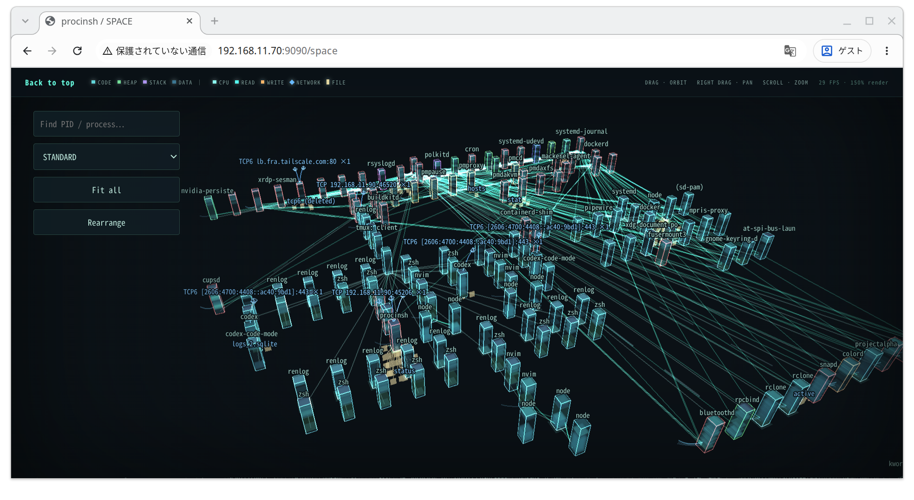

# ProcInSh - Process in the Shell

A web-based process inspector for Linux.
Like [Ghost in the Shell](https://en.wikipedia.org/wiki/Ghost_in_the_Shell), you can wander through process space with your ghost.

_Now, where shall I go? The process space is vast._

## Screenshot



[screenmovie.webm](https://github.com/user-attachments/assets/7e964874-7e5a-46a9-8bb3-0c33defc9f42)

## Usage

Requires Linux x86-64. Both installation methods compile native code and require
Rust, a C compiler, clang with the BPF backend, bpftool, pkg-config, libelf and
zlib development files, and BTF information at `/sys/kernel/btf/vmlinux`.

### Install from crates.io

Install [procinsh from crates.io](https://crates.io/crates/procinsh) and run it:

```sh
cargo install procinsh --locked
sudo "$HOME/.cargo/bin/procinsh" --listen 127.0.0.1:9090
```

The command above uses Cargo's default installation directory. If you use a
custom `CARGO_HOME` or install prefix, adjust the binary path accordingly.

### Self build

Also requires Node.js 22 or newer with npm and Rust via rustup. The Rust version
and components are pinned in `rust-toolchain.toml`; rustup installs them
automatically when needed.

Clone this repository and run the following from its root:

```sh
npm ci
npm run build:web
cargo build --release --locked
```

The web UI is compiled and embedded into the binary. Node.js and npm are not
needed at runtime. Start the release binary:

```sh
sudo ./target/release/procinsh --listen 127.0.0.1:9090
```

### Open the UI

With either installation method, open http://127.0.0.1:9090 in your browser.
Press `Ctrl+C` to stop. See [DEVELOPMENT.md](docs/DEVELOPMENT.md) for development,
testing, API details, and logging options.
