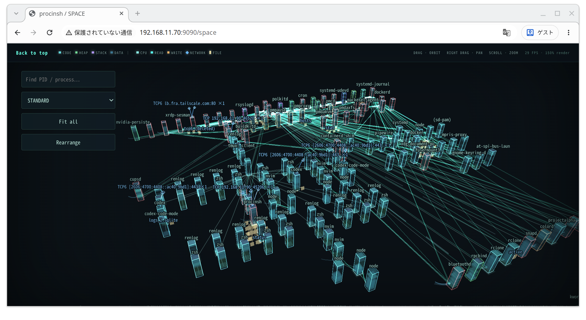

# ProcInSh - Process in the Shell

A web-based process inspector for Linux.
Like [Ghost in the Shell](https://en.wikipedia.org/wiki/Ghost_in_the_Shell), you can wander through process space with your ghost.

_Now, where shall I go? The process space is vast._

## Screenshot



[screenmovie.webm](https://github.com/user-attachments/assets/7e964874-7e5a-46a9-8bb3-0c33defc9f42)

## Usage

Requires Linux x86-64. Both installation methods compile native code and require
Rust, a C compiler, clang with the BPF backend, bpftool, pkg-config, libelf and
zlib development files, and BTF information at `/sys/kernel/btf/vmlinux`.

### Install from crates.io

Install [procinsh from crates.io](https://crates.io/crates/procinsh) and run it:

(Sorry, we assume you are using Ubuntu, please reinterpret not so)
```sh
sudo apt-get install --yes --no-install-recommends \
         build-essential clang llvm pkg-config libelf-dev zlib1g-dev python3 \
         linux-tools-common linux-tools-generic
cargo install procinsh --locked
sudo "$HOME/.cargo/bin/procinsh" --listen 127.0.0.1:9090
```

The command above uses Cargo's default installation directory. If you use a
custom `CARGO_HOME` or install prefix, adjust the binary path accordingly.

### Self build

Also requires Node.js 22 or newer with npm and Rust via rustup. The Rust version
and components are pinned in `rust-toolchain.toml`; rustup installs them
automatically when needed.

Clone this repository and run the following from its root:

```sh
sudo apt-get install --yes --no-install-recommends \
         build-essential clang llvm pkg-config libelf-dev zlib1g-dev python3 \
         linux-tools-common linux-tools-generic
npm ci
npm run build:web
cargo build --release --locked
```

The web UI is compiled and embedded into the binary. Node.js and npm are not
needed at runtime. Start the release binary:

```sh
sudo ./target/release/procinsh --listen 127.0.0.1:9090
```

### Building on WSL2 (Ubuntu)

Ubuntu's `bpftool` wrapper may fail with `bpftool not found for kernel ...`
because the WSL2 kernel version differs from the Ubuntu tools package. Set
`BPFTOOL` to the packaged executable directly, bypassing the wrapper:

```sh
sudo apt-get update
sudo apt-get install --yes --no-install-recommends \
         build-essential clang llvm pkg-config libelf-dev zlib1g-dev python3 \
         linux-tools-common linux-tools-generic
for tool in /usr/lib/linux-tools/*/bpftool; do
    if [ -x "$tool" ]; then
        export BPFTOOL="$tool"
        break
    fi
done
"${BPFTOOL:?No packaged bpftool found; install linux-tools-generic}" version
"$BPFTOOL" btf dump file /sys/kernel/btf/vmlinux format c >/tmp/procinsh-vmlinux.h
npm ci
npm run build:web
cargo build --release --locked
```

### Open the UI

With either installation method, open http://127.0.0.1:9090 in your browser.
Press `Ctrl+C` to stop. See [DEVELOPMENT.md](docs/DEVELOPMENT.md) for development,
testing, API details, and logging options.

### Live process sampling

Process details automatically sample user IP, x86-64 registers and callchains
without stopping the target. `--sample-hz 49` sets the frequency (1–199 Hz);
`--no-callchain` disables callchain collection. Freeze holds the browser display
while sampling continues. Sleeping threads can have stale or no samples.
Instruction bytes are read on demand, after the selected IP sample.

Sampling requires perf access and Linux support for MONOTONIC timestamps and
remove-on-exec events (Linux 5.13+). Permission or resource failures appear in the
sampling panel while available `/proc` panels keep working. STACK_USER and DWARF
unwinding are deferred. The former snapshot endpoint has been removed; clients
should consume the `samples` event on the process detail SSE stream.
