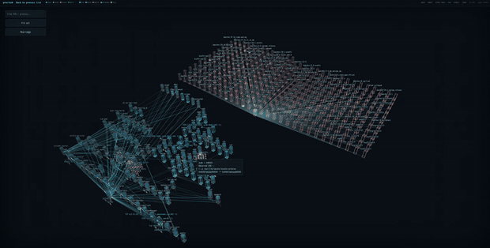
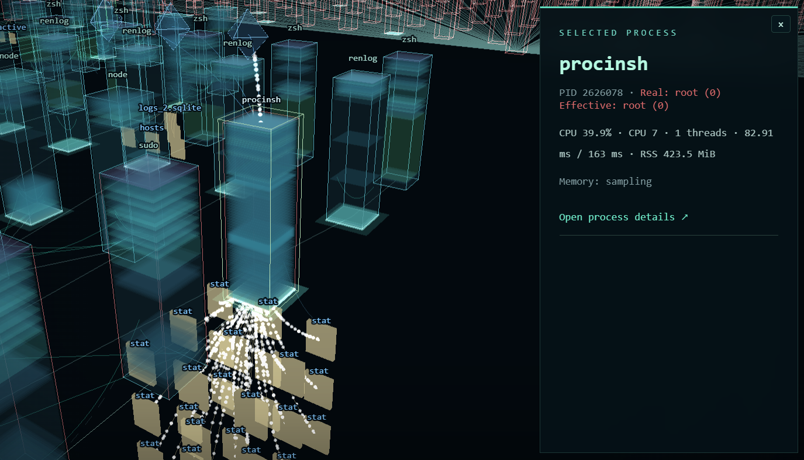
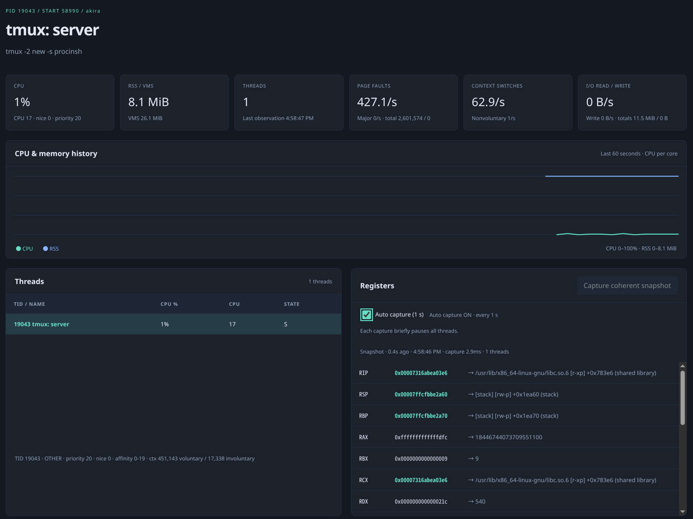
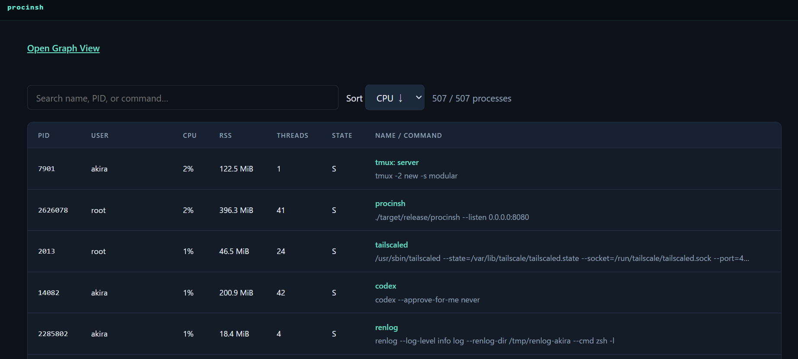

# ProcInSh - Process in the Shell

A web-based process inspector for Linux.
Like [Ghost in the Shell](https://en.wikipedia.org/wiki/Ghost_in_the_Shell), you can wander through process space with your ghost.

See also [a blog post](https://akawashiro.com/articles/procinsh-en).

Join our [Discord server](https://discord.gg/aQuNSczpw) for questions and discussion.

## Screenshot










## Usage

Requires Linux x86-64. Both installation methods compile native code and require
Rust, a C compiler, clang with the BPF backend, bpftool, pkg-config, libelf and
zlib development files, and BTF information at `/sys/kernel/btf/vmlinux`.

Support on WSL2 is very limited, I recommend building procinsh from source rather than installing it from crates.io.
I haven't tested it in container environment such as Docker.

### Install from crates.io

Install [procinsh from crates.io](https://crates.io/crates/procinsh) and run it:

(Sorry, we assume you are using Ubuntu, please reinterpret not so)
```sh
sudo apt-get install --yes --no-install-recommends \
         build-essential clang llvm pkg-config libelf-dev zlib1g-dev python3 \
         linux-tools-common linux-tools-generic
cargo install procinsh --locked
```

Then run and open http://127.0.0.1:9090 in your browser. To allow remote
access, use `--allow-non-loopback`, but be careful: this exposes process memory
and environment variables without any authentication.

```
sudo "$HOME/.cargo/bin/procinsh" --listen 127.0.0.1:9090
```

If you don't want to use `sudo`, please use setcap instead of it.

```
sudo setcap \
  cap_sys_ptrace,cap_bpf,cap_perfmon,cap_dac_read_search=ep \
  "$HOME/.cargo/bin/procinsh"
"$HOME/.cargo/bin/procinsh" --listen 127.0.0.1:9090
```

### Self build

Also requires Node.js 22.12 or newer with npm and Rust via rustup. The Rust version
and components are pinned in `rust-toolchain.toml`; rustup installs them
automatically when needed.

Clone this repository and run the following from its root:

```sh
sudo apt-get install --yes --no-install-recommends \
         build-essential clang llvm pkg-config libelf-dev zlib1g-dev python3 \
         linux-tools-common linux-tools-generic
npm --prefix web ci
npm --prefix web run build
cargo build --release --locked
```

Then run:

```sh
sudo ./target/release/procinsh --listen 127.0.0.1:9090
```

### Building on WSL2 (Ubuntu)

Ubuntu's `bpftool` wrapper may fail with `bpftool not found for kernel ...`
because the WSL2 kernel version differs from the Ubuntu tools package. Set
`BPFTOOL` to the packaged executable directly, bypassing the wrapper:

```sh
sudo apt-get update
sudo apt-get install --yes --no-install-recommends \
         build-essential clang llvm pkg-config libelf-dev zlib1g-dev python3 \
         linux-tools-common linux-tools-generic
for tool in /usr/lib/linux-tools/*/bpftool; do
    if [ -x "$tool" ]; then
        export BPFTOOL="$tool"
        break
    fi
done
"${BPFTOOL:?No packaged bpftool found; install linux-tools-generic}" version
"$BPFTOOL" btf dump file /sys/kernel/btf/vmlinux format c >/tmp/procinsh-vmlinux.h
npm --prefix web ci
npm --prefix web run build
cargo build --release --locked
```

Then run:

```sh
sudo ./target/release/procinsh --listen 127.0.0.1:9090
```

_Now, where shall I go? The process space is vast._
